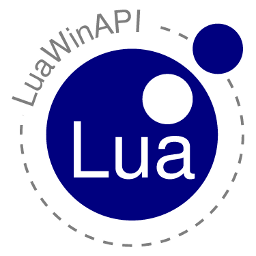

# Introduction

LuaWinAPI is a wrapper for WinAPI functionality.

Because LuaWinAPI is the basis for another project called LuaVenster it's 
development is driven by the LuaVenster requirements. Although the name 
LuaVenster is a reminescent to the Win32 Python GUI libraries Venster and VensterCE 
they have no common roots other than the same spirit in being a 
minimal lightweight wrapper that integrates smoothly into the target language. 

## Features

* wraps parts of user32.dll
* wraps parts of gdi32.dll
* wraps parts of comctl32.dll

# Dependencies

LuaWinAPI depends on the LuaCWrap project. See [LuaCwrap project](http://github.com/oberhofer/luacwrap)
for download and installation instructions.

# Installation via Luarocks

## Prerequisites

For a beginner I would recommend to install the latest "Lua for Windows" 
setup from from the [Lua for windows project](http://luaforwindows.googlecode.com) and install 
LuaWinAPI via LuaRocks.

Install on console via 

    luarocks install luawinapi

# Manual installation

First download the source code via git 

    git clone git://github.com/oberhofer/luawinapi.git master

or unpack the package you got via the download option

## Windows

### Build from source

* Edit ./etc/msvc.bat and set the correct path to the Lua for Windows header and library files.
* Open a Visual Studio .NET Command Prompt
* Change path to the luacwrap root directory
* Execute

    `etc\msvc.bat`

As a result you should have now the files luawinapi.dll within your source directory.
To execute the unittest, do

    cd src
    lua unittest.lua

### Installation

To install LuaWinAPI into Lua for Windows copy the file luawinapi.dll to the Lua for Windows clibs directory.

# Reference

## UNICODE wrappers only

This library does not wrap any ANSI versions of the
WinAPI calls or structs. Only the "W" functions and structs are supported.
The advantage is better portability to WinCE (although not to Win95 but that's ok :-).
As Lua does not support UNICODE directly we have to deal with some inconveniences 
aka. conversions. Fortunately lua has opaque strings so this is not really a problem.

## Wrapped Handles

Parts of the WinAPI are kind of object oriented. The LuaWinAPI project tries
to "recreate" the object oriented nature for window handles. All functions 
where the first parameter is of type HWND are grouped together within a 
type I call an "abstraction". Because of this you are able to call these 
functions in two ways:

* via the pure WinAPI way (e.g. winapi.GetWindow(hwnd))
* via the "abstraction" or object oriented way (e.g. hwnd:GetWindow())

This behaviour is achieved by collecting the appropriate functions and adding 
them to the HWND metatable.

## WNDPROC Callbacks

A central element of the LuaWinAPI library is the creation, registration and 
handling of WNDPROC callbacks. This is done by so called thunks, little stubs 
of code which provide the callback entry point and dispatch the WNDPROC callback
to the registered lua functions. 

To create a WNDPROC callback and associate it with a given lua function write

    WndProc_callback = winapi.WndProc.new(myWndProc)

where myWndProc is a lua function with the following signature

    function myWndProc(hwnd, msg, wParam, lParam)

(In fact there are two additional parameters handed over, but you need them 
only for subclassing. See next chapter.) 

## Subclassing 

Many WinAPI specific programming tasks could be elegantly solved by subclassing 
existing controls. You could use SetWindowLong/GetWindowLong to achive that but
LuaWinAPI provides a convenience shortcut to subclass an existing window.

    Subclass_callback = winapi.WndProc.subclass(hwnd, context, subClassWndProc)
  
The window function always receives two additional parameters a context parameter
which had been specified on subclassing and the prevproc parameter which could be 
used to call the original window procedure.   
 
    function subClassWndProc(hwnd, msg, wParam, lParam, context, prevproc)
      ... do something
      return winapi.CallWindowProcW(prevproc, hwnd, msg, wParam, lParam)
    end

## Generated struct and function wrappers

Most wrappers for structs and simple functions are generated 
from two description files within the gen directory:

* struct.def contains annotated struct declarations
* functions.def contains annotated function declarations

The script genwrap.lua takes these annotations and creates the source files 

* gen\_structs.c / gen\_structs.h
* gen\_abstraction.c / gen\_abstractions.h

The struct declarations are converted into luacwrap compatible descriptors
which could be registered via the luacwrap library.

## Special wrappers

The wrappers for window enumeration have been implemented manually because 
of the callback mechanism and/or return values in use. These functions are

* EnumChildWindows
* EnumThreadWindows
* GetClassNameW
* GetWindowThreadProcessId

## Additional functions

Because of actual needs within LuaVenster there are additional functions 
within the wrapper that extends WinAPI. These are: 

    void DrawXorBar(HDC hdc, int x1, int y1, int width, int height)

# License

LuaWinAPI is licensed under the terms of the MIT license reproduced below.
This means that LuaWinAPI is free software and can be used for both academic
and commercial purposes at absolutely no cost.

Copyright (C) 2011 Klaus Oberhofer

Permission is hereby granted, free of charge, to any person obtaining a copy
of this software and associated documentation files (the "Software"), to deal
in the Software without restriction, including without limitation the rights
to use, copy, modify, merge, publish, distribute, sublicense, and/or sell
copies of the Software, and to permit persons to whom the Software is
furnished to do so, subject to the following conditions:

The above copyright notice and this permission notice shall be included in
all copies or substantial portions of the Software.

THE SOFTWARE IS PROVIDED "AS IS", WITHOUT WARRANTY OF ANY KIND, EXPRESS OR
IMPLIED, INCLUDING BUT NOT LIMITED TO THE WARRANTIES OF MERCHANTABILITY,
FITNESS FOR A PARTICULAR PURPOSE AND NONINFRINGEMENT.  IN NO EVENT SHALL THE
AUTHORS OR COPYRIGHT HOLDERS BE LIABLE FOR ANY CLAIM, DAMAGES OR OTHER
LIABILITY, WHETHER IN AN ACTION OF CONTRACT, TORT OR OTHERWISE, ARISING FROM,
OUT OF OR IN CONNECTION WITH THE SOFTWARE OR THE USE OR OTHER DEALINGS IN
THE SOFTWARE.
